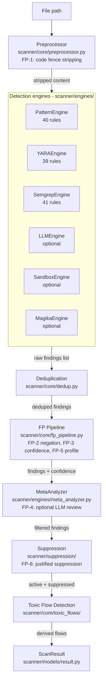
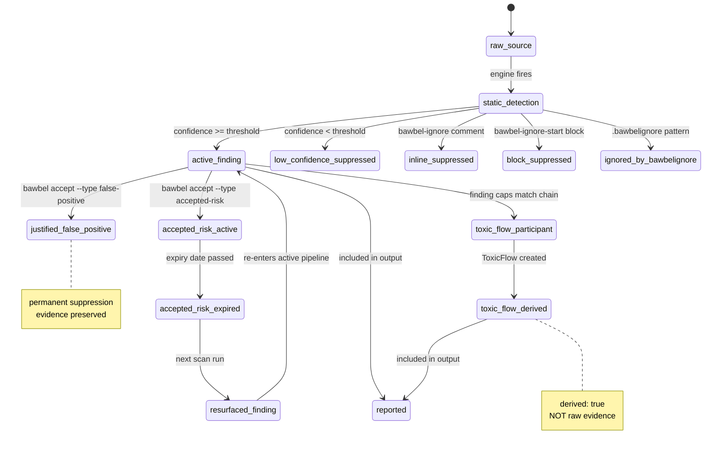
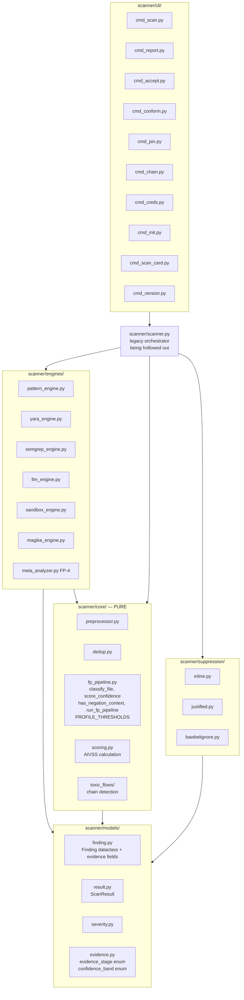

# ARCHITECTURE.md — Bawbel Scanner

Update this file before closing any PR that changes module shape. Read the current state here
before editing any code.

---

## Layer model

```
┌──────────────────────────────────────────────────────┐
│  CLI  scanner/cli/                                    │
│  User input/output only. No logic.                   │
├──────────────────────────────────────────────────────┤
│  Engines  scanner/engines/                            │
│  Subprocess, network, file I/O allowed.              │
│  Calls core/ for pure logic.                         │
├──────────────────────────────────────────────────────┤
│  Core  scanner/core/                                  │
│  PURE. No I/O. No subprocess. No network.            │
│  Tests run in milliseconds.                          │
├──────────────────────────────────────────────────────┤
│  Models  scanner/models/                              │
│  Dataclasses only. No logic. No I/O.                 │
├──────────────────────────────────────────────────────┤
│  Suppression  scanner/suppression/                    │
│  Suppression mechanisms.                             │
└──────────────────────────────────────────────────────┘
```

---

## Scan pipeline

```
File path
   │
   ▼
[Preprocessor]  scanner/core/preprocessor.py
FP-1: strip code fences
   │
   ▼
[Detection Engines]  scanner/engines/  (parallel)
Pattern · YARA · Semgrep · LLM · Sandbox · Magika
   │
   ▼
[Deduplication]  scanner/core/dedup.py
   │
   ▼
[FP Pipeline]  scanner/core/fp_pipeline.py
FP-2 negation · FP-3 confidence · FP-5 profile
   │
   ▼
[MetaAnalyzer]  scanner/engines/meta_analyzer.py
FP-4: optional LLM review of medium-confidence
   │
   ▼
[Suppression]  scanner/suppression/
FP-6: justified suppression
   │
   ▼
[Toxic Flow Detection]  scanner/core/toxic_flows/
   │
   ▼
[ScanResult]  scanner/models/result.py
findings[] · suppressed_findings[] · accepted_findings[] · toxic_flows[]
```



---

## Evidence lifecycle state machine

```
raw_source
    │
    ├─ engine fires ──────────────────▶ static_detection
    │                                         │
    │                    FP-2/FP-3/FP-5 pipeline
    │                                         │
    │                        ┌────────────────┴────────────────┐
    │                confidence >= threshold          confidence < threshold
    │                        │                                  │
    │                  active_finding               low_confidence_suppressed
    │                        │
    │         ┌──────────────┼──────────────┐
    │      bawbel-ignore  bawbel-accept   capability
    │         │           false-positive   matches chain
    │         │                │               │
    │    inline_suppressed  justified_     toxic_flow_
    │                       false_positive participant
    │                                          │
    │                                  ToxicFlow created
    │                                          │
    │                                  toxic_flow_derived
    │
    accepted_risk_active
         │
    expiry passes
         │
    accepted_risk_expired
         │
    next scan
         │
    resurfaced_finding ──▶ active_finding
```



---

## Module map (target state)

```
scanner/core/           PURE
├── preprocessor.py     FP-1: code fence stripping
├── dedup.py            finding deduplication
├── fp_pipeline.py      FP-2/3/5: classify_file, score_confidence,
│                       has_negation_context, run_fp_pipeline,
│                       confidence_band, PROFILE_THRESHOLDS
├── scoring.py          AIVSS calculation math
└── toxic_flows/
    ├── detector.py     chain detection logic
    ├── flows.py        chain definitions
    └── models.py       ToxicFlow dataclass

scanner/models/         DATA
├── finding.py          Finding + evidence fields
├── result.py           ScanResult
├── severity.py         Severity enum
└── evidence.py         evidence_stage enum, confidence_band enum

scanner/engines/        IMPURE
├── pattern_engine.py
├── yara_engine.py
├── semgrep_engine.py
├── llm_engine.py
├── sandbox_engine.py
├── magika_engine.py
└── meta_analyzer.py    FP-4

scanner/suppression/    SUPPRESSION
├── inline.py           bawbel-ignore
├── justified.py        bawbel-accept
└── bawbelignore.py     .bawbelignore

scanner/cli/            BOUNDARY
├── cmd_scan.py
├── cmd_report.py
├── cmd_accept.py
├── cmd_conform.py
├── cmd_pin.py
├── cmd_ssc.py
├── cmd_creds.py
├── cmd_init.py
├── cmd_version.py
└── cmd_chain.py

scanner/scanner.py      LEGACY ORCHESTRATOR (being hollowed out)
```



---

## scanner.py migration status

| Function | Status | Target file |
|---|---|---|
| `_strip_code_fences()` | In scanner.py | scanner/core/preprocessor.py |
| `_classify_file()` | In scanner.py | scanner/core/fp_pipeline.py |
| `_score_confidence()` | In scanner.py | scanner/core/fp_pipeline.py |
| `_has_negation_context()` | In scanner.py | scanner/core/fp_pipeline.py |
| `_deduplicate()` | In scanner.py | scanner/core/dedup.py |
| `scan()` | Stays in scanner.py | Thin coordinator |

---

## Evidence fields migration status (Issue #69)

| Field | Finding model | to_dict() | ToxicFlow |
|---|---|---|---|
| confidence | ☐ | ☐ | ☐ |
| confidence_band | ☐ | ☐ | ☐ |
| evidence_stage | ☐ | ☐ | ☐ |
| evidence_kind | ☐ | ☐ | ☐ |
| evidence_basis | ☐ | ☐ | ☐ |
| confidence_reason | ☐ | ☐ | ☐ |
| derived | ☐ | ☐ | ☐ |

Mark ✓ as each is implemented.

---

## Golden fixture status (Issue #70)

| Fixture | Input | Golden JSON | Test |
|---|---|---|---|
| clean_scan | ☐ | ☐ | ☐ |
| active_finding | ☐ | ☐ | ☐ |
| low_confidence_suppressed | ☐ | ☐ | ☐ |
| inline_suppressed | ☐ | ☐ | ☐ |
| justified_false_positive | ☐ | ☐ | ☐ |
| accepted_risk_active | ☐ | ☐ | ☐ |
| accepted_risk_expired | ☐ | ☐ | ☐ |
| toxic_flow | ☐ | ☐ | ☐ |
| conformance_pass | ☐ | ☐ | ☐ |
| conformance_fail | ☐ | ☐ | ☐ |
| scan_error | ☐ | ☐ | ☐ |

---

## Dependency direction rule

```
cli/ → scanner.py → core/ → models/
                  → engines/ → core/
                  → suppression/ → models/
```

core/ has NO arrows pointing out. Violations are architecture bugs.

---

## PyPI wheel

Must include: scanner/ Python files, yara_rules/*.yar, semgrep_rules/*.yaml
Must NOT include: tests/, docs/, .claude/, .venv/, examples/

Verify: `python -m build && unzip -l dist/bawbel_scanner-*.whl`
