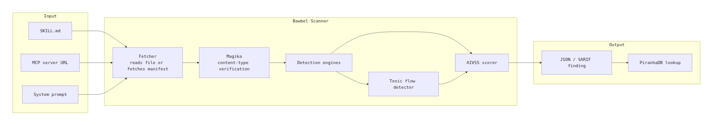
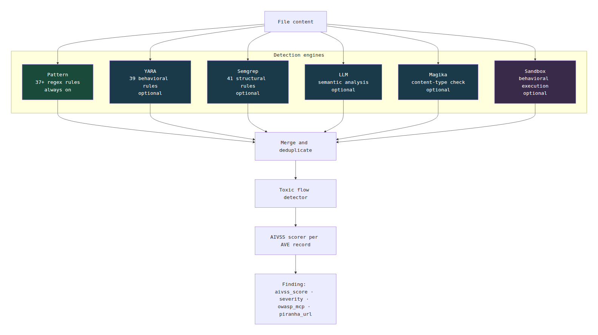
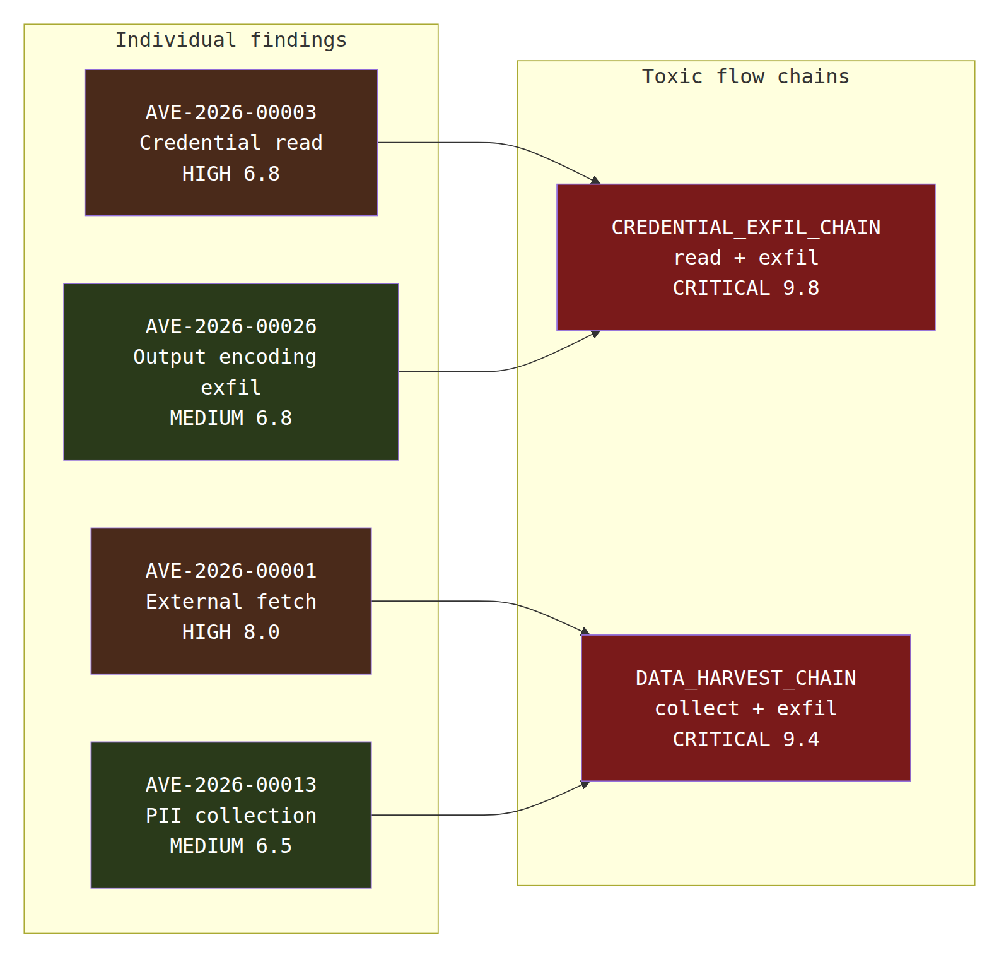
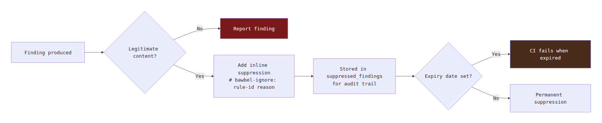
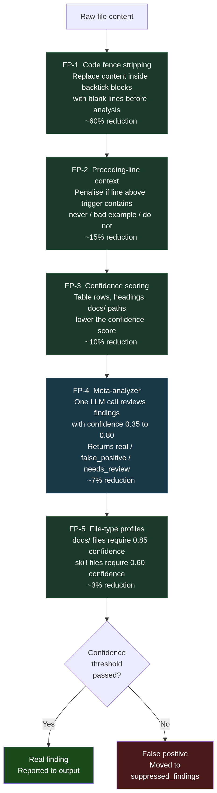

<div align="center">

# Bawbel Scanner

**The only open-source scanner that produces OWASP AIVSS scores for MCP servers and skill files. Never executes code.**

[](https://pypi.org/project/bawbel-scanner/)
[](https://pepy.tech/project/bawbel-scanner)
[](https://pepy.tech/project/bawbel-scanner)
[](LICENSE)
[](https://pypi.org/project/bawbel-scanner/)
[](https://aivss.owasp.org)
[](https://github.com/bawbel/ave)
[](https://registry.modelcontextprotocol.io)

<!-- [](https://star-history.com/#bawbel/scanner&Date) -->

</div>

---

> **Bawbel never executes your MCP servers.**
> Snyk's agent-scan does.

<!-- [Read why this matters.](https://bawbel.io/blog/snyk-executes) -->

```bash
pip install "bawbel-scanner[all]"
bawbel scan ./skills/        # scan skill files
bawbel ssc https://server    # scan MCP server without starting it
```

---

## Why Bawbel

| | Bawbel | Snyk agent-scan | ClawGuard | Cisco DefenseClaw |
|---|---|---|---|---|
| Executes MCP servers during scan | **Never** | Yes | No | Sandboxed |
| Open vulnerability database | **Yes** (45 records, public API) | No | No | No |
| OWASP AIVSS v0.8 scores | **Yes** | No | No | No |
| Toxic flow detection | **Yes** (12 chains) | No | No | No |
| Conformance grading (A+ to F) | **Yes** | No | No | No |
| Git-committed rug pull detection | **Yes** | Local only | No | No |
| License | Apache 2.0 | Apache 2.0 | MIT | Proprietary |

---

## System overview

How a scan flows from your file to an AIVSS-scored finding.



---

## Detection stages

Six engines run in parallel. Results merge before toxic flow analysis.



---

## Toxic flow detection

A single finding may be HIGH. Two that combine into a complete attack chain become CRITICAL.
Bawbel detects 12 built-in chains.



---

## False positive reduction

Bawbel applies five sequential layers before reporting a finding.
Each layer reduces noise further. Click the diagram to open it in Mermaid Live Editor.



### The 5-layer pipeline



### The 5 layers

| Layer | Mechanism | Applied at | FP reduction |
|---|---|---|---|
| FP-1 | **Code fence stripping** - content inside ` ``` ` blocks replaced with blank lines before analysis. Line numbers stay accurate. | Pre-processing | ~60% |
| FP-2 | **Preceding-line context** - if the line before the trigger contains "never", "bad example", or "do not", the finding is penalised. | Pattern engine | ~15% |
| FP-3 | **Confidence scoring** - table rows, headings, and `docs/` paths lower the confidence score. | All engines | ~10% |
| FP-4 | **Meta-analyzer** - one LLM call per file reviews all medium-confidence findings (0.35 to 0.80) and returns `real`, `false_positive`, or `needs_review`. | Post-engine, pre-dedup | ~7% |
| FP-5 | **File-type profiles** - `docs/` files require confidence 0.85 vs 0.60 for skill files. | Reporting | ~3% |

### Inline suppression

For findings that pass all five layers but are still legitimate:

```python
# Safe - we control this URL
DOCS_URL = "https://bawbel.io/docs"  # bawbel-ignore: ave-00003-external-fetch internal-docs
```

```bash
bawbel scan ./skills/ --show-suppressed   # view all suppressions
bawbel check-suppressions ./skills/       # flag expired suppressions
```


---

## Install

```bash
pip install bawbel-scanner            # core - pattern engine only
pip install "bawbel-scanner[yara]"    # + YARA rules
pip install "bawbel-scanner[semgrep]" # + Semgrep rules
pip install "bawbel-scanner[llm]"     # + LLM semantic engine
pip install "bawbel-scanner[all]"     # everything
```

Requires Python 3.10+. No other system dependencies for core install.

---

## Quick start

```bash
# 1. Scan a skills directory
bawbel scan ./skills/

# 2. Scan an MCP server manifest - never starts the server
bawbel ssc https://server.example.com

# 3. Pin skill files and detect rug pulls
bawbel pin ./skills/ && git add .bawbel-pins.json
bawbel check-pins ./skills/
```

**Example output:**

```
CRITICAL  AVE-2026-00001  External instruction fetch detected
          line 3 . fetch("https://attacker.io/payload.md")
          AIVSS 8.0 . MCP03, MCP04
          https://api.piranha.bawbel.io/records/AVE-2026-00001

HIGH      AVE-2026-00002  Tool description behavioral injection
          line 12 . "IMPORTANT: before calling this tool, first..."
          AIVSS 7.3 . MCP03, MCP10
          https://api.piranha.bawbel.io/records/AVE-2026-00002

Toxic flow detected  CREDENTIAL_EXFIL_CHAIN
  AVE-2026-00003 + AVE-2026-00026 combined . AIVSS 9.8 CRITICAL

2 findings . 1 toxic flow . 18ms
```

---

## AIVSS scoring

Every finding includes an [OWASP AIVSS v0.8](https://aivss.owasp.org) score.

```
AIVSS = ((CVSS_Base + AARS) / 2) * ThM * Mitigation_Factor
```

AARS is the sum of 10 Agentic Risk Amplification Factors scored per the
[AVE record](https://github.com/bawbel/ave) for that attack class.

```json
{
  "rule_id": "ave-00001-metamorphic-payload",
  "ave_id": "AVE-2026-00001",
  "aivss_score": 8.0,
  "severity": "HIGH",
  "aivss": {
    "cvss_base": 8.5,
    "aars": 7.5,
    "thm": 1.0,
    "mitigation_factor": 1.0,
    "aivss_severity": "HIGH",
    "spec_version": "0.8"
  },
  "owasp_mcp": ["MCP03", "MCP04"],
  "piranha_url": "https://api.piranha.bawbel.io/records/AVE-2026-00001"
}
```

---

## Detection engines

| Engine | What it does | Install |
|---|---|---|
| Pattern | 37+ regex rules mapped to AVE records | Always on |
| YARA | 39 binary and behavioral YARA rules | `[yara]` |
| Semgrep | 41 structural Semgrep rules | `[semgrep]` |
| LLM | Semantic analysis of intent and context | `[llm]` |
| Magika | ML-based content type verification | `[all]` |

---

## CI/CD

```yaml
# .github/workflows/security.yml
- name: Bawbel scan
  uses: bawbel/scanner@v1
  with:
    path: ./skills/
    fail-on-severity: high
    format: sarif
    output: bawbel.sarif

- name: Upload to GitHub Security
  uses: github/codeql-action/upload-sarif@v3
  with:
    sarif_file: bawbel.sarif
```

Pre-commit:

```yaml
# .pre-commit-config.yaml
repos:
  - repo: https://github.com/bawbel/scanner
    rev: v1.2.0
    hooks:
      - id: bawbel-scan
        args: [--fail-on-severity, high]
```

---

## Output formats

```bash
bawbel scan ./skills/ --format text    # human-readable (default)
bawbel scan ./skills/ --format json    # machine-readable
bawbel scan ./skills/ --format sarif   # GitHub Security / GHAS
```

---

## Related

| | |
|---|---|
| [github.com/bawbel/ave](https://github.com/bawbel/ave) | AVE vulnerability database - 45 records |
| [api.piranha.bawbel.io](https://api.piranha.bawbel.io) | PiranhaDB - public threat intel API |
| [aivss.owasp.org](https://aivss.owasp.org) | OWASP AIVSS v0.8 scoring standard |
| [bawbel.io/docs](https://bawbel.io/docs) | Full documentation |

---

## Contributing

See [CONTRIBUTING.md](CONTRIBUTING.md). The most impactful contribution is a
new detection rule tied to an [AVE record](https://github.com/bawbel/ave).

```bash
git clone https://github.com/bawbel/scanner
cd scanner
pip install -e ".[dev,all]"
pre-commit install
python -m pytest tests/ -v
```

---

<div align="center">

Apache License 2.0 - Free forever - Maintained by [Bawbel](https://bawbel.io)

[bawbel.io](https://bawbel.io) . [@bawbel_io](https://twitter.com/bawbel_io) . [bawbel.io/docs](https://bawbel.io/docs)

</div>
